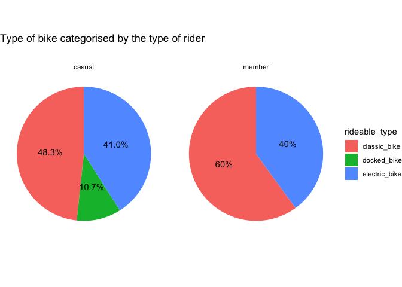
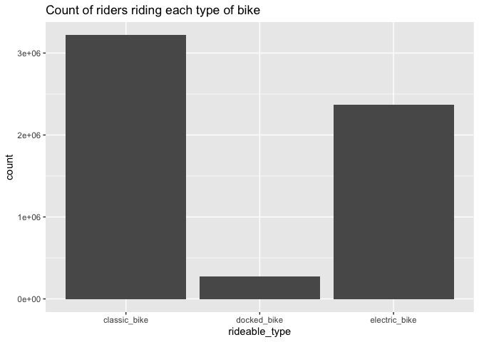
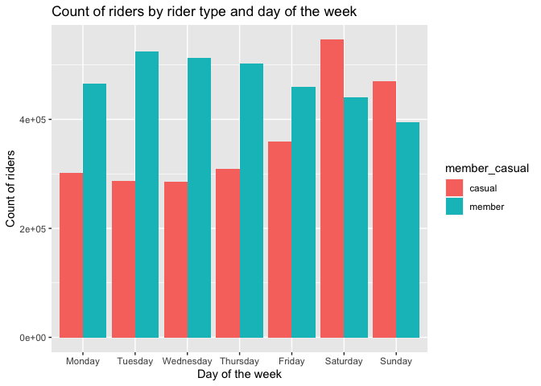
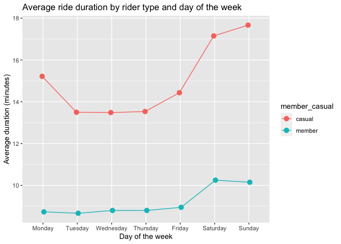
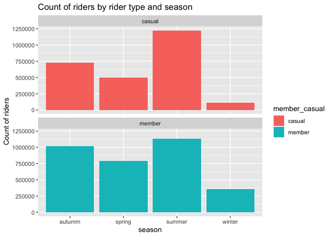
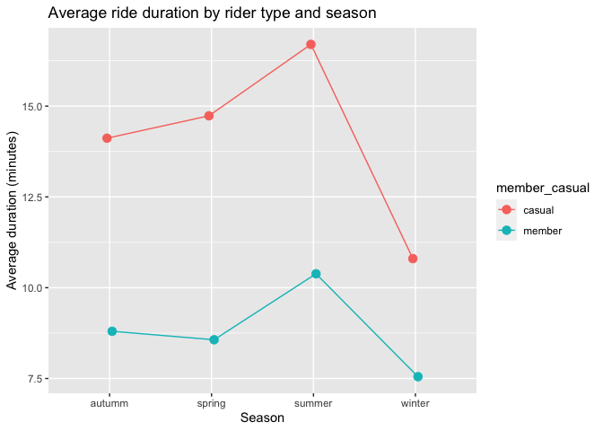
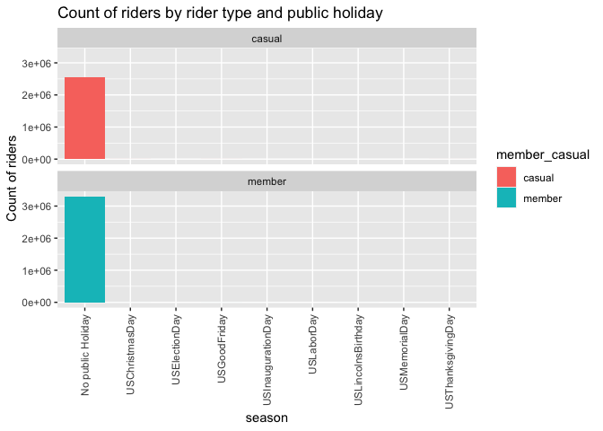

# Scenario
Cyclistic is a bike-share company based in Chicago whose bikes are used by customers to ride for leisure (casual riders) and also to commute to work each day (annual members). The director of marketing believes the company’s future success depends on maximizing the number of annual memberships. Therefore, Cyclists' team want to conduct a thorough analysis to understand how casual and annual riders differ. From the insights they derive, they plan to implement a new marketing strategy to convert casual riders into annual members.

# Business Task
The task is to spot differences in how casual riders and annual members use Cyclistic’s services.
This analysis would be useful for Cyclistic in determining whether converting casual riders into annual members would contribute towards its future success.

# Key Stakeholders
There are many stakeholders involved In this project, including:
* Cyclistic’s executive team
* Lily Moreno
* Cyclistic’s Marketing Analytics team
* Cyclistic customers who have either single-ride passes, full-day passes or annual memberships

# Overview of the data used
The data sources used for this task come from a public data repository, [https://divvy-tripdata.s3.amazonaws.com/index.html](URL 'divvy-tripdata'). For the case study, I have chosen to use the historical data between June 2021 and May 2022. It contains the following field names:

* Ride_id – unique identifier for the trip
* Rideable_type – The type of bike that was used
* Started_at – The time and date the rider took the bike for the trip
* Ended_at - The time and date the rider finished the trip with the bike
* Start_station_name – The station from which the bike was picked up from
* Start_station_id – unique identifier for the start station
* end_station_name - The station from which the bike was kept after the trip
* End_station_id – unique identifier for the end station
* Start_lat – latitude of the start station
* Start longitude – longitude of the start station
* End_lat – latitude of the end station
* End_longitude – longitude of the end station
* Member_casual – field to identify is the rider for a trip is a casual rider or part of the annual membership program
* Ride_Length – Amount of time a Cyclistic bike was used for the ride
* Day_of_Week – day of the week on which the ride was taken

This dataset has over 90,000 records on rides for 12 months, which means we have enough data to deem this dataset reliable. A third party, Motivate International Inc, has put together this dataset. For this reason, it would have a low level of originality. Many parameters are included, and since most of them are self-explanatory, the dataset seems to be quite comprehensive. It is also relatively current as it has been collected within 2021 but is not cited well as it is from a third-party source for whom minimal information is available.
In regards to addressing licensing, this dataset has been provided with royalty-free and non-exclusive access 
Despite its drawbacks from being from a third party, I believe its reliability, comprehensivity, and currency outweigh the disadvantages and make it a recommendable source.

# Tools used to conduct analysis on the data
The tools that will be used to process and analyse the data include the following:

* RStudio & R
  + These two tools would be beneficial in handling all the data in bulk. It would allow easy manipulation of the large data contained within each of the CSV files. Although Microsoft Excel would also be a good option, its inability to handle very large sets of data would slow down the process of making modifications to data.
* Tableau
  + This would be useful in visualising the cleaned data from RStudio. Developing multiple plots, determining overall trends in the data and displaying them on a dashboard would some of the benefits from its use.
  
# Processing data in RStudio with R and cleaning the data
1. Unzipped the data files, placed them in an appropriate folder and renamed them for easier readability
2. Loading in the libraries that would be useful

```r
library(tidyverse)
```

```
## ── Attaching packages ─────────────────────────────────────── tidyverse 1.3.2 ──
## ✔ ggplot2 3.3.6      ✔ purrr   0.3.4 
## ✔ tibble  3.1.8      ✔ dplyr   1.0.10
## ✔ tidyr   1.2.1      ✔ stringr 1.4.1 
## ✔ readr   2.1.3      ✔ forcats 0.5.2 
## ── Conflicts ────────────────────────────────────────── tidyverse_conflicts() ──
## ✖ dplyr::filter() masks stats::filter()
## ✖ dplyr::lag()    masks stats::lag()
```

```r
library(ggplot2)
library(lubridate)
```

```
## 
## Attaching package: 'lubridate'
## 
## The following objects are masked from 'package:base':
## 
##     date, intersect, setdiff, union
```

```r
library(dplyr)
library(readr)
library(janitor)
```

```
## 
## Attaching package: 'janitor'
## 
## The following objects are masked from 'package:stats':
## 
##     chisq.test, fisher.test
```

```r
library(tidyr)
library(here)
```

```
## here() starts at /Users/Thoma/google_data_analytics_data
```

```r
library(skimr)
library(hms)
```

```
## 
## Attaching package: 'hms'
## 
## The following object is masked from 'package:lubridate':
## 
##     hms
```

```r
library(hydroTSM)
```

```
## Loading required package: zoo
## 
## Attaching package: 'zoo'
## 
## The following objects are masked from 'package:base':
## 
##     as.Date, as.Date.numeric
## 
## Loading required package: xts
## 
## Attaching package: 'xts'
## 
## The following objects are masked from 'package:dplyr':
## 
##     first, last
## 
## 
## Attaching package: 'hydroTSM'
## 
## The following object is masked from 'package:tidyr':
## 
##     extract
```

```r
library(timeDate)
library(chron)
```

```
## 
## Attaching package: 'chron'
## 
## The following objects are masked from 'package:lubridate':
## 
##     days, hours, minutes, seconds, years
```

```r
library(data.table)
```

```
## 
## Attaching package: 'data.table'
## 
## The following objects are masked from 'package:xts':
## 
##     first, last
## 
## The following objects are masked from 'package:lubridate':
## 
##     hour, isoweek, mday, minute, month, quarter, second, wday, week,
##     yday, year
## 
## The following objects are masked from 'package:dplyr':
## 
##     between, first, last
## 
## The following object is masked from 'package:purrr':
## 
##     transpose
```

```r
library(Rmisc)
```

```
## Loading required package: lattice
## Loading required package: plyr
## ------------------------------------------------------------------------------
## You have loaded plyr after dplyr - this is likely to cause problems.
## If you need functions from both plyr and dplyr, please load plyr first, then dplyr:
## library(plyr); library(dplyr)
## ------------------------------------------------------------------------------
## 
## Attaching package: 'plyr'
## 
## The following object is masked from 'package:here':
## 
##     here
## 
## The following objects are masked from 'package:dplyr':
## 
##     arrange, count, desc, failwith, id, mutate, rename, summarise,
##     summarize
## 
## The following object is masked from 'package:purrr':
## 
##     compact
```

```r
library(s20x)
```

```
## 
## Attaching package: 's20x'
## 
## The following object is masked from 'package:timeDate':
## 
##     skewness
```

```r
library(leaflet)
```

```
## 
## Attaching package: 'leaflet'
## 
## The following object is masked from 'package:xts':
## 
##     addLegend
```

```r
library(sp)
library(scales)
```

```
## 
## Attaching package: 'scales'
## 
## The following object is masked from 'package:purrr':
## 
##     discard
## 
## The following object is masked from 'package:readr':
## 
##     col_factor
```

3. Loading in the data files and adding them to one data frame for easier access

```r
# Source: https://www.r-bloggers.com/2011/06/merge-all-files-in-a-directory-using-r-into-a-single-dataframe/
# Getting a list of data files in the directory
setwd("~/google_data_analytics_data/data/")
file_list <- list.files()
all_data_df = data.frame()

#looping through the list of data files
for (file in file_list){
  # appending the data from the files to the dataframe
  temp_df <-read.csv(file, header=TRUE, sep=",")
  all_data_df<-rbind(all_data_df, temp_df)
  rm(temp_df)

}

# Viewing the data
head(all_data_df)
```

```
##            ride_id rideable_type          started_at            ended_at
## 1 99FEC93BA843FB20 electric_bike 2021-06-13 14:31:28 2021-06-13 14:34:11
## 2 06048DCFC8520CAF electric_bike 2021-06-04 11:18:02 2021-06-04 11:24:19
## 3 9598066F68045DF2 electric_bike 2021-06-04 09:49:35 2021-06-04 09:55:34
## 4 B03C0FE48C412214 electric_bike 2021-06-03 19:56:05 2021-06-03 20:21:55
## 5 B9EEA89F8FEE73B7 electric_bike 2021-06-04 14:05:51 2021-06-04 14:09:59
## 6 62B943CEAAA420BA electric_bike 2021-06-03 19:32:01 2021-06-03 19:38:46
##   start_station_name start_station_id end_station_name end_station_id start_lat
## 1                                                                         41.80
## 2                                                                         41.79
## 3                                                                         41.80
## 4                                                                         41.78
## 5                                                                         41.80
## 6                                                                         41.78
##   start_lng end_lat end_lng member_casual
## 1    -87.59   41.80  -87.60        member
## 2    -87.59   41.80  -87.60        member
## 3    -87.60   41.79  -87.59        member
## 4    -87.58   41.80  -87.60        member
## 5    -87.59   41.79  -87.59        member
## 6    -87.58   41.78  -87.58        member
```
4. Ensuring that the names of the column headers are unique and have a consistent naming convention

```r
all_data_df <-clean_names(all_data_df)
head(all_data_df)
```

```
##            ride_id rideable_type          started_at            ended_at
## 1 99FEC93BA843FB20 electric_bike 2021-06-13 14:31:28 2021-06-13 14:34:11
## 2 06048DCFC8520CAF electric_bike 2021-06-04 11:18:02 2021-06-04 11:24:19
## 3 9598066F68045DF2 electric_bike 2021-06-04 09:49:35 2021-06-04 09:55:34
## 4 B03C0FE48C412214 electric_bike 2021-06-03 19:56:05 2021-06-03 20:21:55
## 5 B9EEA89F8FEE73B7 electric_bike 2021-06-04 14:05:51 2021-06-04 14:09:59
## 6 62B943CEAAA420BA electric_bike 2021-06-03 19:32:01 2021-06-03 19:38:46
##   start_station_name start_station_id end_station_name end_station_id start_lat
## 1                                                                         41.80
## 2                                                                         41.79
## 3                                                                         41.80
## 4                                                                         41.78
## 5                                                                         41.80
## 6                                                                         41.78
##   start_lng end_lat end_lng member_casual
## 1    -87.59   41.80  -87.60        member
## 2    -87.59   41.80  -87.60        member
## 3    -87.60   41.79  -87.59        member
## 4    -87.58   41.80  -87.60        member
## 5    -87.59   41.79  -87.59        member
## 6    -87.58   41.78  -87.58        member
```
5. Finding any duplicate ride_ids. 

```r
sum(duplicated(all_data_df$ride_id))
```

```
## [1] 0
```

6. Check for NA (blank) values

```r
sum(is.na(all_data_df$ride_id))
```

```
## [1] 0
```

7. Converting the started at and ended at fields from character to datetime

```r
all_data_df$started_at <- ymd_hms(all_data_df$started_at)
all_data_df$ended_at <- ymd_hms(all_data_df$ended_at)
head(all_data_df)
```

```
##            ride_id rideable_type          started_at            ended_at
## 1 99FEC93BA843FB20 electric_bike 2021-06-13 14:31:28 2021-06-13 14:34:11
## 2 06048DCFC8520CAF electric_bike 2021-06-04 11:18:02 2021-06-04 11:24:19
## 3 9598066F68045DF2 electric_bike 2021-06-04 09:49:35 2021-06-04 09:55:34
## 4 B03C0FE48C412214 electric_bike 2021-06-03 19:56:05 2021-06-03 20:21:55
## 5 B9EEA89F8FEE73B7 electric_bike 2021-06-04 14:05:51 2021-06-04 14:09:59
## 6 62B943CEAAA420BA electric_bike 2021-06-03 19:32:01 2021-06-03 19:38:46
##   start_station_name start_station_id end_station_name end_station_id start_lat
## 1                                                                         41.80
## 2                                                                         41.79
## 3                                                                         41.80
## 4                                                                         41.78
## 5                                                                         41.80
## 6                                                                         41.78
##   start_lng end_lat end_lng member_casual
## 1    -87.59   41.80  -87.60        member
## 2    -87.59   41.80  -87.60        member
## 3    -87.60   41.79  -87.59        member
## 4    -87.58   41.80  -87.60        member
## 5    -87.59   41.79  -87.59        member
## 6    -87.58   41.78  -87.58        member
```
8. Adding a calculated field to the data frame to calculate the duration for each ride in minutes.

```r
all_data_df <- mutate(all_data_df, ride_length=as.double(ended_at-started_at, units="mins"))
head(all_data_df)
```

```
##            ride_id rideable_type          started_at            ended_at
## 1 99FEC93BA843FB20 electric_bike 2021-06-13 14:31:28 2021-06-13 14:34:11
## 2 06048DCFC8520CAF electric_bike 2021-06-04 11:18:02 2021-06-04 11:24:19
## 3 9598066F68045DF2 electric_bike 2021-06-04 09:49:35 2021-06-04 09:55:34
## 4 B03C0FE48C412214 electric_bike 2021-06-03 19:56:05 2021-06-03 20:21:55
## 5 B9EEA89F8FEE73B7 electric_bike 2021-06-04 14:05:51 2021-06-04 14:09:59
## 6 62B943CEAAA420BA electric_bike 2021-06-03 19:32:01 2021-06-03 19:38:46
##   start_station_name start_station_id end_station_name end_station_id start_lat
## 1                                                                         41.80
## 2                                                                         41.79
## 3                                                                         41.80
## 4                                                                         41.78
## 5                                                                         41.80
## 6                                                                         41.78
##   start_lng end_lat end_lng member_casual ride_length
## 1    -87.59   41.80  -87.60        member    2.716667
## 2    -87.59   41.80  -87.60        member    6.283333
## 3    -87.60   41.79  -87.59        member    5.983333
## 4    -87.58   41.80  -87.60        member   25.833333
## 5    -87.59   41.79  -87.59        member    4.133333
## 6    -87.58   41.78  -87.58        member    6.750000
```
9. Adding a calculated field to the data frame to find the day of the week at which each ride started.

```r
all_data_df <- mutate(all_data_df, day_of_week=weekdays(as.Date(all_data_df$started_at)))
head(all_data_df)
```

```
##            ride_id rideable_type          started_at            ended_at
## 1 99FEC93BA843FB20 electric_bike 2021-06-13 14:31:28 2021-06-13 14:34:11
## 2 06048DCFC8520CAF electric_bike 2021-06-04 11:18:02 2021-06-04 11:24:19
## 3 9598066F68045DF2 electric_bike 2021-06-04 09:49:35 2021-06-04 09:55:34
## 4 B03C0FE48C412214 electric_bike 2021-06-03 19:56:05 2021-06-03 20:21:55
## 5 B9EEA89F8FEE73B7 electric_bike 2021-06-04 14:05:51 2021-06-04 14:09:59
## 6 62B943CEAAA420BA electric_bike 2021-06-03 19:32:01 2021-06-03 19:38:46
##   start_station_name start_station_id end_station_name end_station_id start_lat
## 1                                                                         41.80
## 2                                                                         41.79
## 3                                                                         41.80
## 4                                                                         41.78
## 5                                                                         41.80
## 6                                                                         41.78
##   start_lng end_lat end_lng member_casual ride_length day_of_week
## 1    -87.59   41.80  -87.60        member    2.716667      Sunday
## 2    -87.59   41.80  -87.60        member    6.283333      Friday
## 3    -87.60   41.79  -87.59        member    5.983333      Friday
## 4    -87.58   41.80  -87.60        member   25.833333    Thursday
## 5    -87.59   41.79  -87.59        member    4.133333      Friday
## 6    -87.58   41.78  -87.58        member    6.750000    Thursday
```

10. Checking if there are any negative ride lengths

```r
sum(all_data_df$ride_length < 0)
```

```
## [1] 139
```
From above, it is evident that a 139 rows of data have over illogical/negative ride lengths. This could have possible been caused due to a system error. For the analysis, we will remove these.

```r
all_data_df <- subset(all_data_df, ride_length >= 0) 
head(all_data_df)
```

```
##            ride_id rideable_type          started_at            ended_at
## 1 99FEC93BA843FB20 electric_bike 2021-06-13 14:31:28 2021-06-13 14:34:11
## 2 06048DCFC8520CAF electric_bike 2021-06-04 11:18:02 2021-06-04 11:24:19
## 3 9598066F68045DF2 electric_bike 2021-06-04 09:49:35 2021-06-04 09:55:34
## 4 B03C0FE48C412214 electric_bike 2021-06-03 19:56:05 2021-06-03 20:21:55
## 5 B9EEA89F8FEE73B7 electric_bike 2021-06-04 14:05:51 2021-06-04 14:09:59
## 6 62B943CEAAA420BA electric_bike 2021-06-03 19:32:01 2021-06-03 19:38:46
##   start_station_name start_station_id end_station_name end_station_id start_lat
## 1                                                                         41.80
## 2                                                                         41.79
## 3                                                                         41.80
## 4                                                                         41.78
## 5                                                                         41.80
## 6                                                                         41.78
##   start_lng end_lat end_lng member_casual ride_length day_of_week
## 1    -87.59   41.80  -87.60        member    2.716667      Sunday
## 2    -87.59   41.80  -87.60        member    6.283333      Friday
## 3    -87.60   41.79  -87.59        member    5.983333      Friday
## 4    -87.58   41.80  -87.60        member   25.833333    Thursday
## 5    -87.59   41.79  -87.59        member    4.133333      Friday
## 6    -87.58   41.78  -87.58        member    6.750000    Thursday
```

11. Checking if there are any null values in the day_of_week column

```r
unique(all_data_df$day_of_week)
```

```
## [1] "Sunday"    "Friday"    "Thursday"  "Wednesday" "Tuesday"   "Saturday" 
## [7] "Monday"
```

```r
# Arranging the days of the week in order
all_data_df$day_of_week <- factor(all_data_df$day_of_week, levels= c("Monday", 
    "Tuesday", "Wednesday", "Thursday", "Friday", "Saturday", "Sunday"))
head(all_data_df[order(all_data_df$day_of_week), ])
```

```
##             ride_id rideable_type          started_at            ended_at
## 20 45ABF9231CC02E3C electric_bike 2021-06-07 22:24:08 2021-06-07 22:35:25
## 33 5A8763CE97B3A8A0 electric_bike 2021-06-07 17:36:35 2021-06-07 17:39:38
## 34 98B404C87F4122E1 electric_bike 2021-06-07 18:52:31 2021-06-07 18:59:09
## 41 33891F0F00036C9C electric_bike 2021-06-21 17:52:15 2021-06-21 17:59:38
## 43 BB76805F3AA2DB21 electric_bike 2021-06-28 02:55:34 2021-06-28 03:16:13
## 46 E0A442C8EE0E9538 electric_bike 2021-06-28 02:27:44 2021-06-28 02:52:45
##    start_station_name start_station_id end_station_name end_station_id
## 20                                                                    
## 33                                                                    
## 34                                                                    
## 41                                                                    
## 43                                                                    
## 46                                                                    
##    start_lat start_lng end_lat end_lng member_casual ride_length day_of_week
## 20     41.79    -87.58   41.78  -87.60        member   11.283333      Monday
## 33     41.79    -87.60   41.78  -87.60        member    3.050000      Monday
## 34     41.78    -87.60   41.79  -87.58        member    6.633333      Monday
## 41     41.89    -87.63   41.91  -87.63        member    7.383333      Monday
## 43     41.78    -87.59   41.80  -87.59        member   20.650000      Monday
## 46     41.77    -87.58   41.78  -87.59        member   25.016667      Monday
```


# Conducting Analysis on the data
1. Find the Season in which each ride occurred

```r
all_data_df <- mutate(all_data_df, season=time2season(all_data_df$started_at, out.fmt = "seasons"))
head(all_data_df)
```

```
##            ride_id rideable_type          started_at            ended_at
## 1 99FEC93BA843FB20 electric_bike 2021-06-13 14:31:28 2021-06-13 14:34:11
## 2 06048DCFC8520CAF electric_bike 2021-06-04 11:18:02 2021-06-04 11:24:19
## 3 9598066F68045DF2 electric_bike 2021-06-04 09:49:35 2021-06-04 09:55:34
## 4 B03C0FE48C412214 electric_bike 2021-06-03 19:56:05 2021-06-03 20:21:55
## 5 B9EEA89F8FEE73B7 electric_bike 2021-06-04 14:05:51 2021-06-04 14:09:59
## 6 62B943CEAAA420BA electric_bike 2021-06-03 19:32:01 2021-06-03 19:38:46
##   start_station_name start_station_id end_station_name end_station_id start_lat
## 1                                                                         41.80
## 2                                                                         41.79
## 3                                                                         41.80
## 4                                                                         41.78
## 5                                                                         41.80
## 6                                                                         41.78
##   start_lng end_lat end_lng member_casual ride_length day_of_week season
## 1    -87.59   41.80  -87.60        member    2.716667      Sunday summer
## 2    -87.59   41.80  -87.60        member    6.283333      Friday summer
## 3    -87.60   41.79  -87.59        member    5.983333      Friday summer
## 4    -87.58   41.80  -87.60        member   25.833333    Thursday summer
## 5    -87.59   41.79  -87.59        member    4.133333      Friday summer
## 6    -87.58   41.78  -87.58        member    6.750000    Thursday summer
```

```r
unique(all_data_df$season)
```

```
## [1] "summer" "autumm" "winter" "spring"
```
2. Finding if any of the dates were public holiday and what were the public holidays

```r
# Lising of public holidays in the USA
hlist <- c("USNewYearsDay", "USInaugurationDay", "USMLKingsBirthday", "USLincolnsBirthday", "USWashingtonsBirthday", "USMemorialDay", "USIndependenceDay", "USLaborDay", "USColumbusDay", "USElectionDay", "USVeteransDay", "USThanksgivingDay", "USChristmasDay", "USCPulaskisBirthday", "USGoodFriday")

# Creating a new field in the data frame to identify if the started date was a public holiday
all_data_df <- mutate(all_data_df, is_public_holiday=date(started_at) == as.character(holiday(2021:2022,hlist)))
```

```
## Warning in `==.default`(date(started_at), as.character(holiday(2021:2022, :
## longer object length is not a multiple of shorter object length
```

```r
# Creating a new field in the data frame to identify the holiday
all_data_df <- mutate(all_data_df, which_public_holiday=ifelse(date(started_at) == as.character(holiday(2021:2022,hlist)), hlist, "No public Holiday"))
```

```
## Warning in `==.default`(date(started_at), as.character(holiday(2021:2022, :
## longer object length is not a multiple of shorter object length
```

```r
head(all_data_df)
```

```
##            ride_id rideable_type          started_at            ended_at
## 1 99FEC93BA843FB20 electric_bike 2021-06-13 14:31:28 2021-06-13 14:34:11
## 2 06048DCFC8520CAF electric_bike 2021-06-04 11:18:02 2021-06-04 11:24:19
## 3 9598066F68045DF2 electric_bike 2021-06-04 09:49:35 2021-06-04 09:55:34
## 4 B03C0FE48C412214 electric_bike 2021-06-03 19:56:05 2021-06-03 20:21:55
## 5 B9EEA89F8FEE73B7 electric_bike 2021-06-04 14:05:51 2021-06-04 14:09:59
## 6 62B943CEAAA420BA electric_bike 2021-06-03 19:32:01 2021-06-03 19:38:46
##   start_station_name start_station_id end_station_name end_station_id start_lat
## 1                                                                         41.80
## 2                                                                         41.79
## 3                                                                         41.80
## 4                                                                         41.78
## 5                                                                         41.80
## 6                                                                         41.78
##   start_lng end_lat end_lng member_casual ride_length day_of_week season
## 1    -87.59   41.80  -87.60        member    2.716667      Sunday summer
## 2    -87.59   41.80  -87.60        member    6.283333      Friday summer
## 3    -87.60   41.79  -87.59        member    5.983333      Friday summer
## 4    -87.58   41.80  -87.60        member   25.833333    Thursday summer
## 5    -87.59   41.79  -87.59        member    4.133333      Friday summer
## 6    -87.58   41.78  -87.58        member    6.750000    Thursday summer
##   is_public_holiday which_public_holiday
## 1             FALSE    No public Holiday
## 2             FALSE    No public Holiday
## 3             FALSE    No public Holiday
## 4             FALSE    No public Holiday
## 5             FALSE    No public Holiday
## 6             FALSE    No public Holiday
```

3. Finding the months during which the trips started and ended at

```r
all_data_df$month_start <- format(as.Date(all_data_df$started_at), '%b_%y')
all_data_df$month_end <- format(as.Date(all_data_df$ended_at), '%b_%y')
head(all_data_df)
```

```
##            ride_id rideable_type          started_at            ended_at
## 1 99FEC93BA843FB20 electric_bike 2021-06-13 14:31:28 2021-06-13 14:34:11
## 2 06048DCFC8520CAF electric_bike 2021-06-04 11:18:02 2021-06-04 11:24:19
## 3 9598066F68045DF2 electric_bike 2021-06-04 09:49:35 2021-06-04 09:55:34
## 4 B03C0FE48C412214 electric_bike 2021-06-03 19:56:05 2021-06-03 20:21:55
## 5 B9EEA89F8FEE73B7 electric_bike 2021-06-04 14:05:51 2021-06-04 14:09:59
## 6 62B943CEAAA420BA electric_bike 2021-06-03 19:32:01 2021-06-03 19:38:46
##   start_station_name start_station_id end_station_name end_station_id start_lat
## 1                                                                         41.80
## 2                                                                         41.79
## 3                                                                         41.80
## 4                                                                         41.78
## 5                                                                         41.80
## 6                                                                         41.78
##   start_lng end_lat end_lng member_casual ride_length day_of_week season
## 1    -87.59   41.80  -87.60        member    2.716667      Sunday summer
## 2    -87.59   41.80  -87.60        member    6.283333      Friday summer
## 3    -87.60   41.79  -87.59        member    5.983333      Friday summer
## 4    -87.58   41.80  -87.60        member   25.833333    Thursday summer
## 5    -87.59   41.79  -87.59        member    4.133333      Friday summer
## 6    -87.58   41.78  -87.58        member    6.750000    Thursday summer
##   is_public_holiday which_public_holiday month_start month_end
## 1             FALSE    No public Holiday      Jun_21    Jun_21
## 2             FALSE    No public Holiday      Jun_21    Jun_21
## 3             FALSE    No public Holiday      Jun_21    Jun_21
## 4             FALSE    No public Holiday      Jun_21    Jun_21
## 5             FALSE    No public Holiday      Jun_21    Jun_21
## 6             FALSE    No public Holiday      Jun_21    Jun_21
```


```r
unique(all_data_df$is_public_holiday)
```

```
## [1] FALSE  TRUE
```

```r
unique(all_data_df$which_public_holiday)
```

```
## [1] "No public Holiday"  "USChristmasDay"     "USGoodFriday"      
## [4] "USInaugurationDay"  "USLaborDay"         "USLincolnsBirthday"
## [7] "USMemorialDay"      "USElectionDay"      "USThanksgivingDay"
```

4. Analysis of ride duration and number of riders categorised by type of rider

```r
# ride duration categorised by type of rider
all_data_df %>% dplyr::group_by(member_casual) %>% dplyr::summarise(min_ride_length = min(ride_length), median_ride_length = median(ride_length), max_ride_length = max(ride_length))
```

```
## # A tibble: 2 × 4
##   member_casual min_ride_length median_ride_length max_ride_length
##   <chr>                   <dbl>              <dbl>           <dbl>
## 1 casual                      0              15.3           55944.
## 2 member                      0               9.12           1560.
```

```r
# number of riders categorised by type of rider
all_data_df %>% dplyr::group_by(member_casual) %>% dplyr::summarise(total_riders = min(n()))
```

```
## # A tibble: 2 × 2
##   member_casual total_riders
##   <chr>                <int>
## 1 casual             2559796
## 2 member             3300841
```
From above, it seems like casual riders, on average, ride 6.35 minutes longer than members despite their headcount being less by 741045. In order to increase the conversion rate of casual riders to members, it may be worth taking note of this and make altercations in the current offerings to cater to more long range rides.

5. Analysis of bike type by type of rider

```r
pie_df <- all_data_df %>% dplyr::group_by(member_casual, rideable_type) %>% dplyr::summarise(count = n()) %>% dplyr::mutate(ratio = (count/sum(count))) %>% dplyr::mutate(percentage = scales::percent(ratio))
```

```
## `summarise()` has grouped output by 'member_casual'. You can override using the
## `.groups` argument.
```

```r
ggplot(data=pie_df, aes(x="", y=ratio, fill=rideable_type)) +
         geom_col() + geom_text(aes(label = percentage), position = position_stack(vjust = 0.5)) +
         coord_polar("y", start=0) +
         facet_grid(.~ member_casual) + theme_void() + labs(title = "Type of bike categorised by the type of rider") + theme(plot.title = element_text(vjust = 10))
```

<!-- -->


```r
# Count of riders riding each bike
ggplot(all_data_df, aes(x = rideable_type)) + geom_bar() + labs(title = "Count of riders riding each type of bike")
```

<!-- -->

```r
all_data_df %>% group_by(start_station_name, member_casual, rideable_type, season, day_of_week, start_lat, start_lng) %>% dplyr::summarise(n_count = n()) %>% dplyr::arrange(desc(n_count)) %>% filter(start_station_name != "" & rideable_type == "docked_bike", n_count >= 914)
```

```
## `summarise()` has grouped output by 'start_station_name', 'member_casual',
## 'rideable_type', 'season', 'day_of_week', 'start_lat'. You can override using
## the `.groups` argument.
```

```
## # A tibble: 10 × 8
## # Groups:   start_station_name, member_casual, rideable_type, season,
## #   day_of_week, start_lat [10]
##    start_station_name     membe…¹ ridea…² season day_o…³ start…⁴ start…⁵ n_count
##    <chr>                  <chr>   <chr>   <chr>  <fct>     <dbl>   <dbl>   <int>
##  1 Streeter Dr & Grand A… casual  docked… summer Saturd…    41.9   -87.6    2272
##  2 Streeter Dr & Grand A… casual  docked… summer Sunday     41.9   -87.6    2061
##  3 Streeter Dr & Grand A… casual  docked… summer Friday     41.9   -87.6    1505
##  4 Streeter Dr & Grand A… casual  docked… summer Monday     41.9   -87.6    1240
##  5 Streeter Dr & Grand A… casual  docked… summer Tuesday    41.9   -87.6    1176
##  6 Streeter Dr & Grand A… casual  docked… autumm Saturd…    41.9   -87.6    1094
##  7 Streeter Dr & Grand A… casual  docked… summer Wednes…    41.9   -87.6    1031
##  8 Michigan Ave & Oak St  casual  docked… summer Saturd…    41.9   -87.6     930
##  9 Millennium Park        casual  docked… summer Saturd…    41.9   -87.6     928
## 10 Streeter Dr & Grand A… casual  docked… summer Thursd…    41.9   -87.6     914
## # … with abbreviated variable names ¹​member_casual, ²​rideable_type,
## #   ³​day_of_week, ⁴​start_lat, ⁵​start_lng
```

From the plots above, it seems that the preferred bike of choice for all riders (both members and casual riders) is the classic bike while the least preferred is the docked bike. Out of the different types of riders, a greater proportion of members seem to favour the classic bike as compared to the casual riders, however, the proportion of riders (both members and casual riders) who use the electric bike is the approximately the same. Something that a small percentage (approximately 10.7%) of casual riders utilise, unlike the members, are docked bikes. Thus, it may be worth thinking about introducing docked bike discount/promotions to convert the population of casual docked bike users to members. Although this population is quite small compared to other bike type users, Cyclistic should recognise that this percentage attributes for 274442 casual riders, and converting these many riders could potentially be profitable for the long run of the business. Docker bike promotions should be aimed at casual riders starting the service out of Streeter Dr & Grand Ave during summer and on the weekends.

6. Analysis of count of rider by the type of rider and by day of week

```r
avg_duration_df <- all_data_df %>% dplyr::group_by(day_of_week, member_casual) %>% dplyr::summarise(median_ride_length = median(ride_length), n_count = n())
```

```
## `summarise()` has grouped output by 'day_of_week'. You can override using the
## `.groups` argument.
```

```r
ggplot(avg_duration_df) + geom_bar(aes(x = day_of_week, y=n_count, fill = member_casual), stat="identity", position="dodge") + labs(title = "Count of riders by rider type and day of the week", x = "Day of the week", y = "Count of riders")
```

<!-- -->

7. Analysis of average rider duration by the type of rider and by day of week

```r
ggplot(avg_duration_df, aes(x=day_of_week, y=median_ride_length, colour=member_casual, group=member_casual)) +
    geom_line(position=position_dodge(0.1)) +
    geom_point(position=position_dodge(0.1), size=3) + labs(title = "Average ride duration by rider type and day of the week", x = "Day of the week", y = "Average duration (minutes)")
```

<!-- -->
From the plots above, we can see that casual riders usually use Cyclistic's services more in the weekends than in the weekdays to travel long distances. On the other hand, annual members use the services more on the weekdays than on the weekends to travel shorter distances. We can also see that casual riders tend to use Cyclistics's service most on Saturdays and the least on Wednesdays. Members tend to use Cyclistic's services most on Tuesdays and least on Sundays. Casual riders also, on average, ride between 16 and 18 minutes during the weekends while members ride for approximately 10 to 11 minutes. On average we also see that casual riders ride for longer than members do every day of the week. This and the plot from 6. suggests that members are using Cyclistic's services  on the weekdays to possibly to travel short distances for work purposes while casual riders are using it on the weekends for travelling long distances to conduct leisure activities / exercise. It may be worth for Cyclistic to take note of this and implement promotions for riders riding for longer durations which could potentially increase conversion rate for casual riders. Conducting conpetitions such as bike marathons on weekends could also potentially be successful in increasing the coinversion rate.

7. Analysis of count of rider by the type of rider and by season

```r
avg_duration_season_df <- all_data_df %>% dplyr::group_by(season, member_casual) %>% dplyr::summarise(median_ride_length = median(ride_length), n_count = n())
```

```
## `summarise()` has grouped output by 'season'. You can override using the
## `.groups` argument.
```

```r
ggplot(avg_duration_season_df) + 
  geom_bar(aes(x = season, y=n_count, fill = member_casual), stat="identity", position="dodge") + 
  labs(title = "Count of riders by rider type and season", x = "season", y = "Count of riders") + 
  facet_wrap(.~ member_casual, ncol=1)
```

<!-- -->

8. Analysis of ride duration by type of rider and by season

```r
ggplot(avg_duration_season_df, aes(x=season, y=median_ride_length, colour=member_casual, group=member_casual)) +
    geom_line(position=position_dodge(0.1)) +
    geom_point(position=position_dodge(0.1), size=3) + labs(title = "Average ride duration by rider type and season", x = "Season", y = "Average duration (minutes)")
```

<!-- -->
From the plots above, we can see that most of the riders (members and casuals) ride during summer and the least during winter. The same can be said about the ride durations for both casual and member riders. In summer, casual riders ride more than members by approximately 6 minutes while in winter, casual riders ride more than members by approximately 5.5 minutes. In general, casual riders ride for longer than members. To increase conversion rate of casual riders, it may be worth increasing the number of available bikes during summer and offerring promotions/competitions to incentivise casual riders to use Cyclistic's service more and gradually convert into members.

9. Analysis of count of rider by type of rider and by public holiday

```r
avg_duration_holiday_df <- all_data_df %>% dplyr::group_by(which_public_holiday, member_casual) %>% dplyr::summarise(median_ride_length = median(ride_length), n_count = n())
```

```
## `summarise()` has grouped output by 'which_public_holiday'. You can override
## using the `.groups` argument.
```

```r
ggplot(avg_duration_holiday_df) + 
  geom_bar(aes(x = which_public_holiday, y=n_count, fill = member_casual), stat="identity", position="dodge") + 
  labs(title = "Count of riders by rider type and public holiday", x = "season", y = "Count of riders") + 
  facet_wrap(.~ member_casual, ncol=1) + theme(axis.text.x = element_text(angle = 90, vjust = 0.5, hjust=1))
```

<!-- -->

From the plot above, it seems that both members and casual riders don't ride much on public holidays. However, it is also apparent that there is a higher population of members that do not ride on public holidays  Thus, it may be better off for Cyclistic

10. Location analysis by member type

```r
all_data_df %>% group_by(start_station_name, member_casual, start_lat, start_lng) %>% dplyr::summarise(n_count = n()) %>% dplyr::arrange(desc(n_count)) %>% filter(start_station_name != "" & n_count >= 15494)
```

```
## `summarise()` has grouped output by 'start_station_name', 'member_casual',
## 'start_lat'. You can override using the `.groups` argument.
```

```
## # A tibble: 10 × 5
## # Groups:   start_station_name, member_casual, start_lat [10]
##    start_station_name                 member_casual start_lat start_lng n_count
##    <chr>                              <chr>             <dbl>     <dbl>   <int>
##  1 Streeter Dr & Grand Ave            casual             41.9     -87.6   55499
##  2 DuSable Lake Shore Dr & Monroe St  casual             41.9     -87.6   19315
##  3 Kingsbury St & Kinzie St           member             41.9     -87.6   18170
##  4 Clark St & Elm St                  member             41.9     -87.6   18106
##  5 Theater on the Lake                casual             41.9     -87.6   17181
##  6 Wells St & Concord Ln              member             41.9     -87.6   17112
##  7 Michigan Ave & Oak St              casual             41.9     -87.6   16951
##  8 Millennium Park                    casual             41.9     -87.6   16372
##  9 DuSable Lake Shore Dr & North Blvd casual             41.9     -87.6   15752
## 10 Ellis Ave & 60th St                member             41.8     -87.6   15494
```


```r
all_data_df %>% group_by(end_station_name, member_casual, end_lat, end_lng) %>% dplyr::summarise(n_count = n()) %>% dplyr::arrange(desc(n_count)) %>% filter(end_station_name != "" & n_count >= 17658)
```

```
## `summarise()` has grouped output by 'end_station_name', 'member_casual',
## 'end_lat'. You can override using the `.groups` argument.
```

```
## # A tibble: 10 × 5
## # Groups:   end_station_name, member_casual, end_lat [10]
##    end_station_name                   member_casual end_lat end_lng n_count
##    <chr>                              <chr>           <dbl>   <dbl>   <int>
##  1 Streeter Dr & Grand Ave            casual           41.9   -87.6   60995
##  2 Kingsbury St & Kinzie St           member           41.9   -87.6   21312
##  3 Clark St & Elm St                  member           41.9   -87.6   20800
##  4 Wells St & Concord Ln              member           41.9   -87.6   20153
##  5 DuSable Lake Shore Dr & Monroe St  casual           41.9   -87.6   19817
##  6 DuSable Lake Shore Dr & North Blvd casual           41.9   -87.6   19690
##  7 Michigan Ave & Oak St              casual           41.9   -87.6   19560
##  8 Theater on the Lake                casual           41.9   -87.6   19426
##  9 Millennium Park                    casual           41.9   -87.6   19042
## 10 Wells St & Elm St                  member           41.9   -87.6   17658
```

From the table above, we can see that for casual members, most of them start and end using Cyclistic's service in Streeter Dr & Grand Ave with a total of 55499 rows. As such, to increase conversion rates of casual riders, Cyclistic should focus promotions/competitions in that area in order to engage with the casual riders.


# Top 3 Recommendations to increase conversion rate of causual riders

1. Offer promotions/competitions for riders riding for longer durations (>=13 minutes) and for riders using the service on the weekends (especially Saturdays) at Streeter Dr & Grand Ave.

2. Promoting the use of bikes during summer.

3. Continuing to offer electric and classic bike services as they are the most popular bike services but also piloting an increase in the currennt offerings for docked bikes, especially at places such as Streeter Dr & Grand Ave during summer and the weekends.

Please also see: [Tableau Visualisation](https://public.tableau.com/app/profile/sebastian.thomas7257/viz/CyclisticBikeShareAnalysis_16777008614140/CyclisticBikeShareAnalysis)

